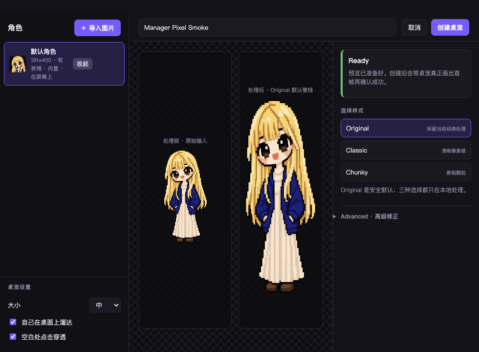
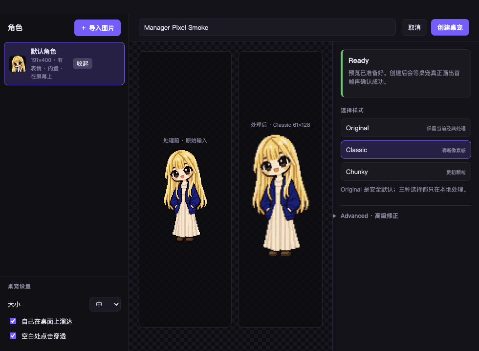

# Poppet — 像素立绘桌宠

[](https://github.com/SioYooo/poppet/actions/workflows/ci.yml)
[](LICENSE)

把一张自己的像素立绘变成会呼吸、眨眼、回应点击并在桌面上溜达的桌宠。
Poppet 是面向 macOS 与 Windows 的本地优先 Electron 应用：无需账号，当前源码没有遥测、
云端图片处理或自动更新客户端。

> **当前状态：Public Alpha。** 本仓库通过 clean-history 路线公开（单一初始提交，
> 不含私有开发历史）。默认金发角色由作者 Sioyoo 使用 OpenAI 图像生成（gpt-image）
> 创建并按 Poppet 专用许可授权，其来源与 C2PA 披露见
> [docs/default-character-provenance.md](docs/default-character-provenance.md)；
> 未打包的黑发参考图按同一范围授权随仓库发布。二进制 Release 由 fail-closed 门禁
> 与受保护的发布环境逐次把关，首个 alpha 为 unsigned controlled alpha。
> 请勿把本仓库产物宣传为已发布的稳定版。



| Classic 像素化预设 | 桌宠实际渲染帧 |
| --- | --- |
|  |  |

以上截图均使用随包默认金发角色，说明见 [docs/media/README.md](docs/media/README.md)。

## 能做什么

- 导入透明背景或纯色背景的像素立绘，并在本地自动去背、裁剪和量化。
- 可选 Tiny、Chunky、Classic、Detailed 本地像素化预设；处理完全确定、非生成式 AI，
  默认 Original 保持原有输出路径。
- 保守地自动定位眼睛与嘴；检测评分过低时不启用眨眼，识别不准可手工重画并在保存前预览眨眼。
- 支持静态图片、GIF 和手动指定网格的 sprite sheet。
- 生成呼吸、眨眼、嘴型、点击反馈、拖拽、落地和走动效果。
- 多帧素材可按行为分段（待机 / 走路 / 拖拽 / 招手），桌宠按当前状态播对应的那几帧，
  而不是整条帧带无差别循环。
- 支持关节骨架角色：部件画一次，走路摆臂、迈腿、悬空垂挂、落地屈膝、招手由运行时算出，
  表情用整块部件替换。管理器可以调枢轴、接点、层序与驱动器增益并实时预览
  （只能编辑已有骨架，不能凭空生成——骨架是作者标的，不是从图里检测的）。
- Create 会先原子保存角色，再等待对应桌宠真正显示并画出首个非空帧后才提示成功；
  如果角色已保存但显示失败，可直接重试而不会重复导入。
- 管理多个角色，最多同时显示 6 只，并记住各自位置。
- 支持把自建角色导出为 `.poppetpack` 角色包、或导入他人分享的角色包；
  归档按 fail-closed 安全边界校验（大小/条目/哈希/膨胀比），内置品牌角色不允许导出。
- 桌宠设置提供 30/45/60 fps 帧率档位（省电模式），即时生效。
- 支持点击穿透、多显示器，以及 macOS/Windows 平台差异。
- 应用图标、macOS 菜单栏图标与 Windows 通知区域图标固定使用随包金发角色；
  免费 Core 不允许替换，用户自选品牌图标仅保留给未来付费功能，当前尚未实现。

复杂背景仍需先在其他工具中去背；Poppet 会明确提示而不会假装已完成高级抠图。

关于肢体动作，需要说清楚一件事：**单张立绘不会长出手脚。** 一张扁平立绘里没有"手臂
背后是什么"的像素，也没有"哪些像素挡在手臂前面"的信息，所以把手臂抠出来转动无法还原
——实测在内置角色上，任何补洞策略都只会把挖空处填成邻近的某个颜色，看起来是一块板子而
不是一条手臂。Poppet 只复用原图已有的像素，不凭空生成肢体。

上面那条测量否掉的是「**从**一张扁平图**推断**出肢体」，不是「肢体动画」本身。素材本来
就按肢体画的，就另当别论。所以 Poppet 有三档，一个角色只走其中一档：

- **单张立绘** —— 呼吸、眨眼、口型、拖拽倾斜、落地压实，以及按腰线做非线性剪切的走动。
- **多帧素材（`frames.clips`）** —— 每个姿势是画出来的。把排成网格的动画表按行列切分，
  再用"分段"标成待机 / 走路 / 拖拽 / 招手，桌宠按当前行为播对应的那几帧。
- **关节骨架（`skeleton`，schemaVersion 3）** —— 部件只画一次，姿势由运行时**算**出来：
  骨骼声明自己跟随哪些运动信号（走路摆动、呼吸、悬空垂挂、落地冲击、招手）以及跟多少，
  左右反相就是一个负号。表情靠整块部件替换（头部另备闭眼 / 张嘴两张图），不是覆盖层。

骨架不是从图里检测出来的，是作者标的：管理器可以**编辑**已有骨架（枢轴、接点、层序、
增益，带实时预览），但不能凭空创建一个——那需要一份普通导入管线不会产出的骨骼图集。
分发的角色包走后两档。

播放能力完整存在于免费 Core：付费的是美术与包本身，不是播放器。

## 从源码运行

要求：Node.js 22、npm，以及受支持的 macOS 或 Windows 开发环境。

```bash
git clone https://github.com/SioYooo/poppet.git
cd poppet
npm ci
npm test
npm start
```

首次启动会把随应用提供的内置角色复制到用户数据目录。金发内置角色使用独立的
Poppet 专用素材许可，不随代码一起采用 MIT；详见
[ASSETS_LICENSE.md](ASSETS_LICENSE.md)。首次从旧工作名版本升级时，Poppet 会在单实例
保护下把既有资料复制到新的 Poppet 用户资料目录，并保留旧目录作为回退副本；遇到冲突
或不安全路径会停止，而不会合并或覆盖角色与设置。若这台机器上同时存在 Poppet 与旧版资料目录而
没有迁移标记，`npm start` 会按设计拒绝启动；此时可用 `npm run dev:isolated` 在一个用后即删的
临时 profile 里交互式运行，不会读写真实资料目录。

## 使用

从托盘菜单打开“角色管理”，拖入图片或选择图片文件。处理后可以比较/选择本地像素化
风格、校正表情区域、选择移动方式、预览并保存。桌宠支持以下基本操作：

| 操作 | 行为 |
| --- | --- |
| 单击 | 随机动作 |
| 按住拖动 | 拎起并移动，松手后落地 |
| 右键或托盘菜单 | 管理角色和设置 |
| 放置不管 | 呼吸、眨眼，并可按设置溜达 |

用户角色与设置保存在 Electron 的本机用户数据目录。请保留原始图片的独立备份；Alpha
阶段不要把 Poppet 角色库当作唯一副本。隐私边界见 [PRIVACY.md](PRIVACY.md)。

## 开发与验证

```bash
npm test                    # 可移植的源码与算法回归测试
npm run test:file -- test/security/storage.test.cjs   # 只运行单个测试文件（也接受目录）
npm run test:extraction     # 去背接口与端到端回归
npm run test:pixelize       # 像素化算法与管理器接线
npm run test:security       # IPC、路径、预算与恶意输入边界
npm run test:studio         # 禁用的 Studio 合约边界
npm run survey              # 合成形态巡检
npm run test:click          # Electron 点击/拖拽渲染事件链回归
npm run test:manager        # 隔离 profile 的导入/像素化/重启回归
npm run test:multi          # 多桌宠 IPC 路由回归
npm run pack:mac            # 在 macOS 原生构建 dmg/zip
npm run pack:win            # 在 Windows 原生构建 installer/portable
npm run verify:package      # 检查实际 app.asar 的生产包纯度
npm run preflight:release   # 本地按顺序回放 release 工作流的 validate 门禁
npm run qualify:native      # 在当前系统上跑自动资格链并输出结构化证据报告
npm run inspect:pack -- --json <文件>.poppetpack   # 离线诊断角色包（只读）
```

`npm test` 是 clean-checkout/CI 合约。GUI 与平台行为仍需在真实操作系统上验证；在一台
系统上交叉构建不能代替另一台系统上的安装、启动、托盘、点击穿透和重启恢复证据。

## Release 状态

每次推送到 main，GitHub Actions 在 Ubuntu 与 Windows 上跑完整测试套件与 Windows 冒烟；
macOS 测试与原生 macOS/Windows 的 unsigned 打包（含包纯度校验）按每周定时与手动触发跑，
打包 job 只在 runner 临时磁盘上验证期望的发布文件集，成功时不再向 Actions Artifact
存储上传 400-700MB 的安装包；打 tag 时 release 工作流仍会完整跑一遍。这样分是因为
私有仓库的 macOS runner 折算约 10 倍额度，且每个 job 各自向上取整到整分钟。只有
prerelease tag、版本、法律/权属 policy、测试、依赖审计、包纯度、产物集合和哈希全部通过，
才允许创建 GitHub prerelease。

`.github/release-policy.json` 的两条门禁记录（仓库公开审批、仓库内素材权属）已于
2026-08-29 置为 `VERIFIED`：仓库以 clean-history 路线公开（单一初始提交，不含私有
历史），公开仓库的 hosted CI 已在 main 上跑绿。任何字节或许可变化都会重新关闭
对应门禁。

黑发根目录参考图已于 2026-08-24 补齐授权记录（所有者自生成的 AI 图，同一份 Poppet 范围
授权）；`docs/default-character-provenance.md` 同时记录了它与金发源图的证据强度差别。

随包金发美术及图标的作者、来源、权利人与再分发许可当前已标记 `VERIFIED`；任何
字节或许可变化都会重新关闭该门禁。

本地完成构建或 CI 上传 artifact 都不是公开 Release。首个候选
`v0.1.0-alpha.1` 即使获准发布也会明确标记 unsigned controlled alpha：macOS 可能触发
Gatekeeper，Windows 可能触发 SmartScreen。不要关闭系统级安全保护。

发布门禁的 fail-closed 权威记录是 [.github/release-policy.json](.github/release-policy.json)；
prerelease 自动化（tag 谱系校验、跨平台清单与哈希验证、受保护发布环境）见
[.github/workflows/release.yml](.github/workflows/release.yml)。

## 项目结构

```text
src/main/              Electron 主进程、窗口、IPC、平台与本地角色库
src/renderer/pet/      桌宠画布、状态机与渲染循环
src/renderer/manager/  角色导入与管理界面
src/shared/            图像管线、部件规整与形态算法
tools/                 测试、素材构建和诊断工具
assets/characters/     随包角色数据（独立 Poppet 专用素材许可）
.github/workflows/     CI 与 fail-closed prerelease 自动化
```

图像管线、部件 schema、动画约束、多窗口 IPC、持久化与调试设计详见
[架构与工程笔记](docs/architecture.md)；角色包的安全格式见
[`.poppetpack` 格式](docs/poppetpack-format.md)。这些文档记录
设计或研究结论，不替代真实平台或 Release 验收。

## 公开项目约定

- 代码采用 [MIT License](LICENSE)。美术素材不自动继承 MIT；见
  [ASSETS_LICENSE.md](ASSETS_LICENSE.md) 与
  [THIRD_PARTY_NOTICES.md](THIRD_PARTY_NOTICES.md)。
- 贡献前阅读 [CONTRIBUTING.md](CONTRIBUTING.md)。
- 漏洞走 [SECURITY.md](SECURITY.md) 的私密渠道；一般问题见
  [SUPPORT.md](SUPPORT.md)。
- [`.github/FUNDING.yml`](.github/FUNDING.yml) 中的 GitHub Sponsors 入口当前整体注释停用：
  只有在 2FA、收款、税务和 GitHub 审批完成、Sponsors 页面真实存在后才会启用；
  Ko-fi URL 尚未核实，因此没有编造配置。

Poppet 当前不包含 Free/Pro、授权服务器或支付 SDK。免费开源、可选打赏与后续 Steam 决策
是相互独立的 Gate，Stars 或下载量也不会被当成留存或付费意愿的证明。
